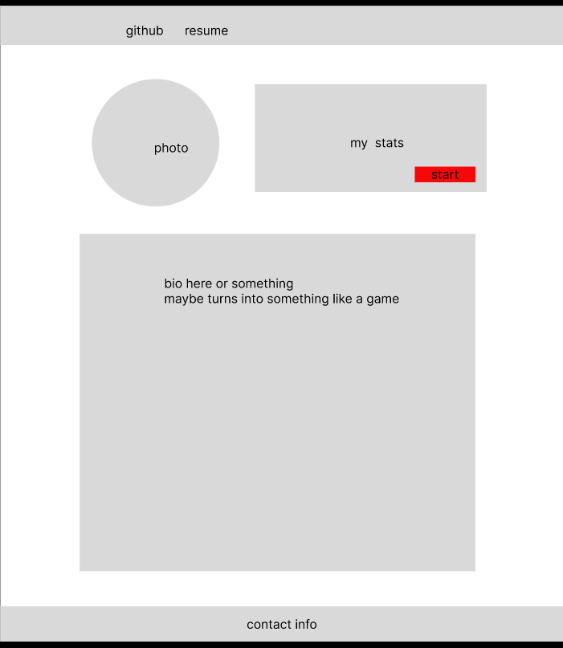

# hellwraiz.github.io

# The plan

## Here's first I have exactly what I want to have on the website, alongside maybe some sketches or something else idk.

## List of things that I want:
* resume
* something interactive like a game
* how to contact me
* previous work or something
* bio

## First I'll want to have a basic outline of the front page. I'll probably make something in paint or something else, anyways, here it is:

## ideas for the interactive part:
* pop quiz about bio
* pac-man with words as obstacles
* drawing something to then show in the document
* obnoxious puzzle
* maze
* physics engine
* some random minigame idk
* donkey kong
* farming simulator??
* star invaders
* secret thing hiding the rain frog image
* arg??
* where's waldo

I'll probably also have a single photo, then when hover on photo something pops up, and doing something let's me start playing the game

